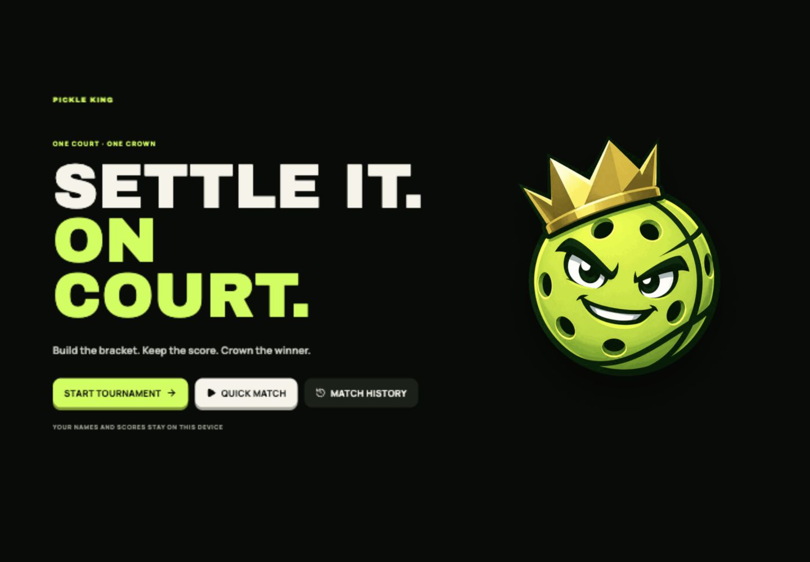
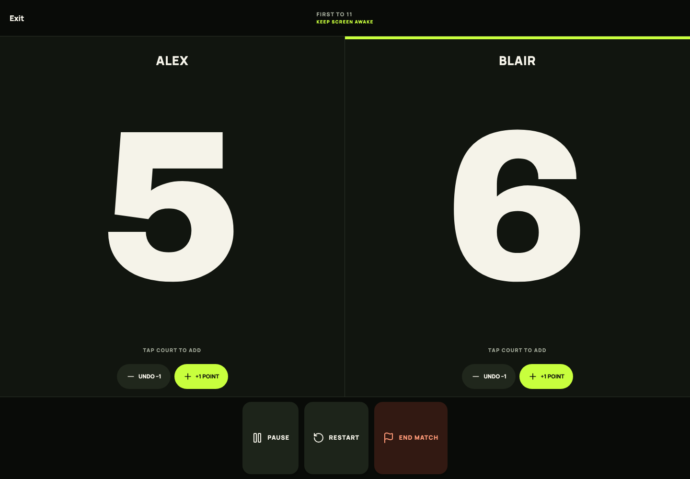
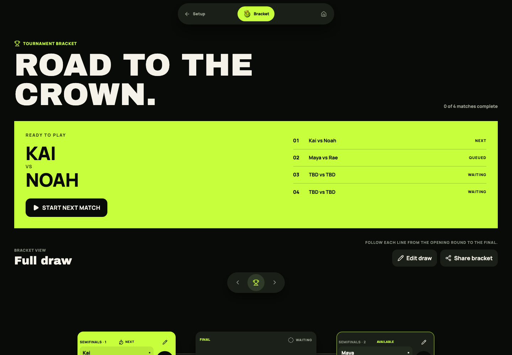
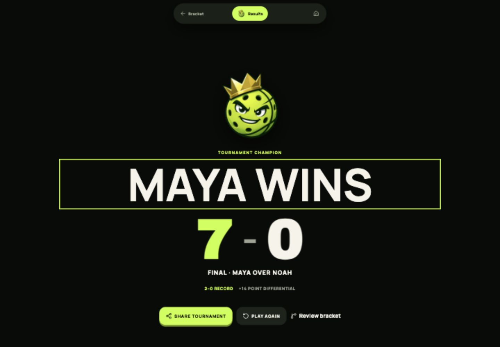

<p align="center">
  
</p>

<h1 align="center">Pickle King</h1>

<p align="center">
  <strong>Run the court. Crown the best.</strong><br>
  An offline-first tournament director and scorekeeper for pickleball nights.
</p>

<p align="center">
  <a href="#run-it-locally">Get started</a> ·
  <a href="#contributing">Contributing</a> ·
  <a href="SECURITY.md">Security</a> ·
  <a href="LICENSE">MIT License</a>
</p>

Pickle King helps a group run a fair one-court pickleball tournament without
accounts, trackers, or a connection. Build the draw, keep the score, manage
the schedule, and save or share the result—all on the device in your hands.

## What it does

- Builds 4–16 player knockout brackets with automatic byes and protected rest.
- Offers Competitive and Social draws, plus round-robin finals for 4–6 players.
- Runs timed or untimed scoring with win-by-two, golden point, corrections, and
  restart controls.
- Includes a standalone Quick Match for singles or doubles.
- Keeps a bounded local history, name suggestions, match statistics, and
  replayable results.
- Creates shareable champion, recap, player-stat, and full-bracket PNGs on the
  device.

## Screens

<p align="center">
  
  
</p>
<p align="center">
  
  
</p>

## Run it locally

Requires Node.js 22.13 or newer.

```bash
git clone https://github.com/In-sp3ctr3/pickle-king.git
cd pickle-king
npm ci
npm run dev
```

Open [http://127.0.0.1:3000](http://127.0.0.1:3000). For a deployed instance,
copy `.env.example` and set `NEXT_PUBLIC_SITE_URL` to its canonical public URL.

## Quality

The repository uses strict TypeScript, ESLint, Prettier, unit tests, browser
workflow coverage, a rendered HTML check, PWA artifact tests, CodeQL, and
dependency review. Run the same core gate locally before opening a pull
request:

```bash
npm run check
npm run format:check
npm audit --audit-level=high
```

For browser checks, keep `npm run dev` running in another terminal:

```bash
npm run frontend:test
npm run frontend:test:workflows
```

`npm run test:pwa` verifies the production service-worker artifacts directly.

## Release versions

The version in `package.json` is the release source of truth and appears
discreetly on the home screen. New work starts as `x.y.z-alpha.1`, advances to
`x.y.z-beta.1` for field testing, and drops the suffix only for a stable
production release. Every release commit bumps that value before verification
and deployment.

## Privacy

Pickle King is local-first by design. Player names, scores, and recent history
stay in browser storage; the app has no accounts, analytics, cloud database,
or server API. Share images are generated locally and leave the device only
when someone chooses to share or download them. Clearing site data removes the
saved local sessions and history.

## Project structure

- `app/` — thin application shell and route metadata.
- `src/tournament/` and `src/match/` — deterministic tournament and scoring
  rules.
- `src/features/` — user-facing tournament, scoring, sharing, and history
  flows.
- `src/persistence/` — validated browser-storage boundary.
- `tests/` — integration, browser, rendered-output, and PWA checks.

Architecture decisions and feature specifications live in
[docs/architecture](docs/architecture) and [specs](specs).

## Contributing

Contributions are welcome. Please read [CONTRIBUTING.md](CONTRIBUTING.md) for
local setup, branch and pull-request expectations, and required verification.
By participating, you agree to follow the [Code of Conduct](CODE_OF_CONDUCT.md).

For bugs and ideas, use the repository’s issue templates. For responsible
vulnerability reporting, follow [SECURITY.md](SECURITY.md) rather than opening
a public issue.

## License

Pickle King is released under the [MIT License](LICENSE). Third-party software
and design acknowledgements are listed in
[THIRD_PARTY_NOTICES.md](THIRD_PARTY_NOTICES.md).
